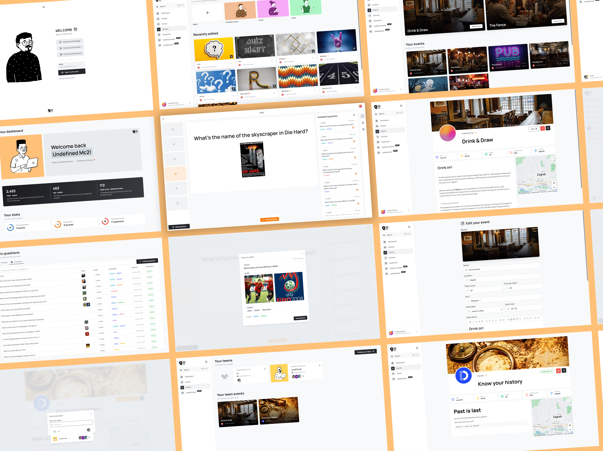

# Qwiz ✌🏻


<br />

> Qwiz is a platform for creation, organization & discovery of pub quizzes. 

<br />



---

Project built for the [TVZ Mc2](https://mc2.tvz.hr/) 2021 student competition - one of the biggest project-based student programming competitions in Croatia.

### [🎬 Video Demo | Google Drive](https://drive.google.com/file/d/1swh3Bd43ThSkKgEnOpwXu9OcoUbOqt0l/view?usp=sharing)
### [🧰 API Documentation | Postman](https://documenter.getpostman.com/view/15639222/UyrDCvUG)

--- 

#### 🎤 Pitch deck
- [Final](https://pitch.com/public/3279f068-7a65-4838-8d7c-5c5906123cc0)
- [Initial](https://pitch.com/public/ce709700-e619-46a5-bbe3-afd0eb5570d6)


## Installation and running locally

```bash
# Clone the repo
git clone https://github.com/qwiz-app/qwiz.git qwiz
cd qwiz

# Install compatable Node version and deps
node -v  #16.13.2
npm i

# Start the frontend server
npm run frontend

# Start the backend server
npm run backend
```

## Tech Stack

- **Client:** Next.js, TypeScript, Mantine UI, React Query, Formik, Framer Motion, Zustand, Next Auth

- **Server:** Nest.js, Prisma, PlanetScale (MySQL)

- **Tooling:** NX, Vercel, Hetzner, AWS SES, S3 and Lambda, Plausible Analytics, Sentry, Uptime Kuma


## Environment Variables

To run this project, add the following environment variables to your project

```bash
# .env
DATABASE_URL="DATABASE_URL="mysql://url"
```

```bash
# apps/frontend/.env.local
NEXTAUTH_URL=http://localhost:4200
GITHUB_CLIENT_ID=
GITHUB_CLIENT_SECRET=
GOOGLE_CLIENT_SECRET=
GOOGLE_CLIENT_SECRET=
NEXT_PUBLIC_GOOGLE_MAPS_KEY=
SECRET={openssl rand -base64 32}
NEXTAUTH_SECRET={openssl rand -base64 32}
NEXT_PUBLIC_PLAUSIBLE_DOMAIN={domain url without protocol}
NEXT_PUBLIC_PLAUSIBLE_URL={domain url}
NEXT_PUBLIC_PLAUSIBLE_API_KEY=
SENTRY_DSN=
NEXT_PUBLIC_SENTRY_DSN=
SENTRY_IGNORE_API_RESOLUTION_ERROR=1 
NEXT_PUBLIC_AWS_BUCKET_URL=
AWS_IMG_ROOT={bucket url without protocol}
AWS_SES_REGION=
SMTP_USER=
SMTP_PASS=
SMTP_FROM=
PUPPETEER_SECRET={openssl rand -base64 32}
```

```
# apps/backend/.env
AWS_BUCKET_ACCESS_KEY=
AWS_BUCKET_SECRET_KEY=
AWS_BUCKET_NAME=
AWS_BUCKET_REGION=
AWS_BUCKET_URL=
PUPPETEER_SECRET={openssl rand -base64 32}
FRONTEND_URL=http://localhost:4200`
```
